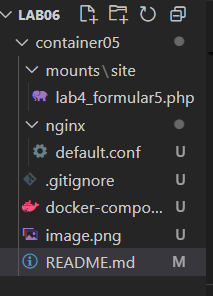
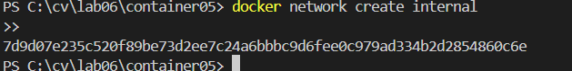
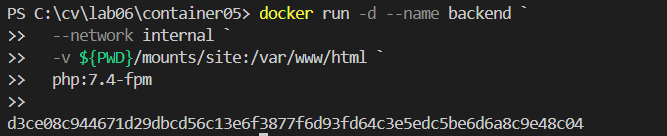
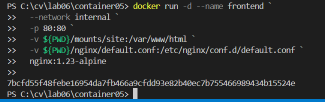
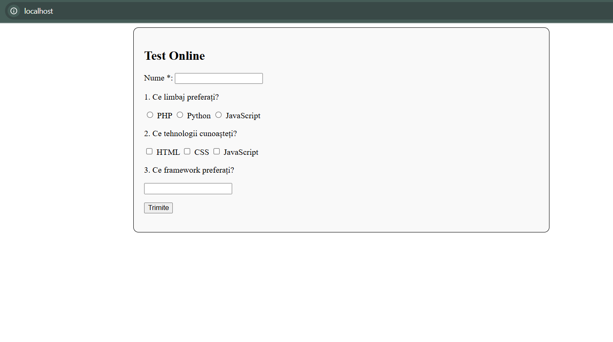

# Interacțiunea containerelor

# Scopul lucrării
Gestionarea interacțiunilor între mai multe containere.

# Sarcina
Creați o aplicație PHP pe baza a două containere: nginx, php-fpm.

# Realizarea lucrarii
1. am creat repozitoriul container05 si am facut git clone prin terminal.
2. am creat directoriul mounts/site si am copiat un site php.
3. am creat fisierul .gitignore si am adaugat urmatorul text:
#Ignore files and directories
mounts/site/*
4. am creat directorul nginx/default.conf si am adaugat textul necesar.

# Pornire si testare
1. creem reteaua internal pentru containere

2. creem containerul backend cu următoarele proprietăți:
pe baza imaginii php:7.4-fpm;
directorul mounts/site este montat în /var/www/html;
funcționează în rețeaua internal.

3. creem containerul frontend cu următoarele proprietăți:
pe baza imaginii nginx:1.23-alpine;
directorul mounts/site este montat în /var/www/html;
fișierul nginx/default.conf este montat în /etc/nginx/conf.d/default.conf;
portul 80 al containerului este expus pe portul 80 al calculatorului gazdei;
funcționează în rețeaua internal.

4. deschidem localhost:

# Raspuns la intrebari:
1. În ce mod în acest exemplu containerele pot interacționa unul cu celălalt?
backend (PHP-FPM) și Frontend (Nginx) sunt conectate la aceeași rețea Docker (internal), ceea ce le permite să comunice între ele. În special, Nginx (frontend) va comunica cu PHP-FPM (backend) pentru a procesa fișierele PHP.

2. Cum văd containerele unul pe celălalt în cadrul rețelei internal?
frontend-ul (Nginx) poate să ajungă la backend-ul (PHP-FPM) folosind numele backend, așa cum este configurat în fișierul Nginx:
fastcgi_pass backend:9000;

3. De ce a fost necesar să se suprascrie configurarea Nginx?
suprascrierea configurației Nginx a fost necesară pentru a personaliza comportamentul serverului web astfel încât să îndeplinească cerințele aplicației PHP.
